# 拼豆图纸工作室（Perler Beads Studio）

浏览器里把图片转成「按品牌色卡匹配」的拼豆网格图纸：支持 **Perler**、**Artkal S 5mm**、**Hama Midi** 全量 JSON 色卡，导出 **PNG** / **PDF**，并生成 **材料消耗清单**。

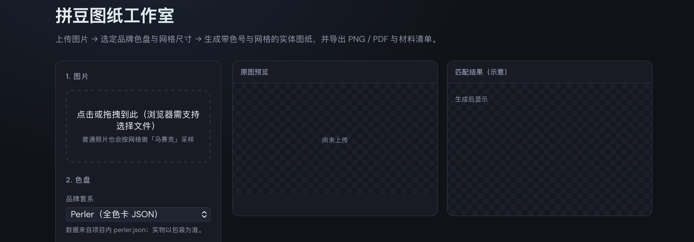
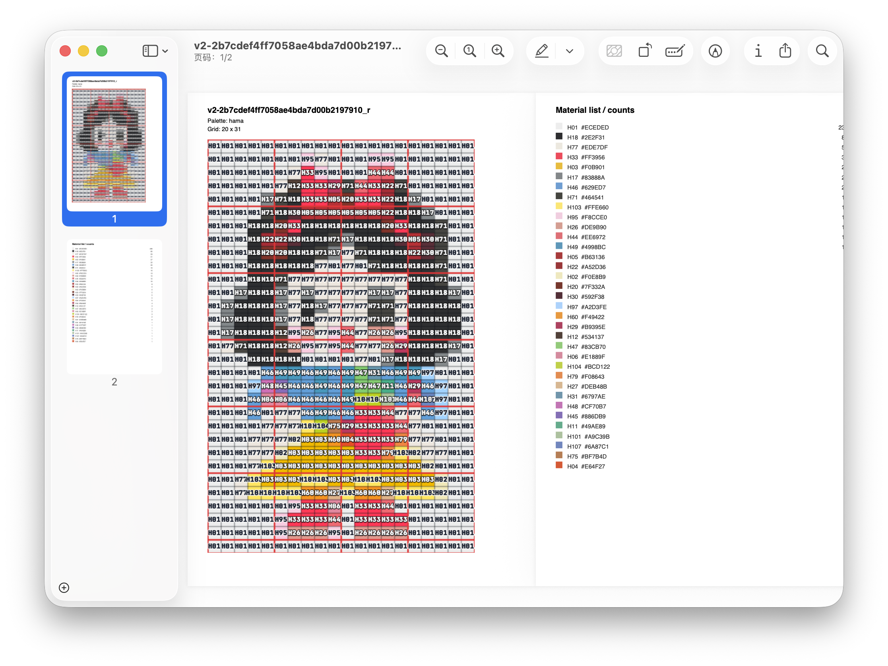
---

## 本地启动

### 环境要求

- **Node.js** 建议 18+（与 Vite 5 兼容即可）
- **npm** 或 pnpm / yarn（下文以 npm 为例）

### 安装依赖

在项目根目录（含 `package.json` 的目录）执行：

```bash
npm install
```

### 开发模式（热更新）

```bash
npm run dev
```

终端里会打印本地地址（一般为 `http://localhost:5173`），用浏览器打开即可。

### 生产构建与本地预览构建结果

```bash
npm run build
npm run preview
```

`build` 会先做 TypeScript 检查再输出到 `dist/`；`preview` 用于本地查看打包后的站点。

---

## 使用指南（界面里能调什么）

### 1. 上传图片

- 支持常见 **位图**（如 PNG、JPEG、WebP）。
- 上传后可用侧栏重新点选区域换图。
- 普通照片会按你设定的 **列×行** 做下采样，相当于 **像素化 / 马赛克**。


### 2. 选择品牌色盘

下拉框三选一，数据来自仓库内 JSON（见下文「色卡数据」）：

| 选项 | 数据文件 | 参考网址
|------|-----------| ----------------- |
| Perler | `src/data/palettes/perler.json` | https://www.pixel-beads.com/zh/perler-bead-color-chart |
| Artkal S 5mm | `src/data/palettes/artkal-s-5mm.json` | https://www.pixel-beads.com/zh/artkal-bead-color-chart |
| Hama Midi | `src/data/palettes/hama-midi.json` | https://www.pixel-beads.com/zh/hama-bead-color-chart |

切换品牌后，需再点 **「生成拼豆图纸」** 才会用新色盘重算。

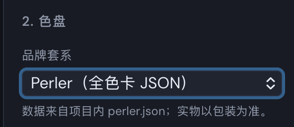
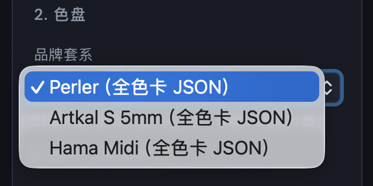

### 3. 网格（豆子数量）

- **锁定原图比例**：勾选后，改「最长边格数」或改列/行之一时，另一维会按原图宽高比自动推算（4～128 格）。
- **最长边格数滑块**：在锁定比例且已上传图时，一键控制疏密。
- **快捷按钮**：24 / 40 / 56 / 80「格边」——有原图时按原图比例套长边。
- **宽（列）/ 高（行）精确输入**：可微调格数；锁定开启时改一边会联动另一边。
- **按原图比例：长边拉满**：把较长边顶到 **128 格上限**（仍受比例约束）。

取消「锁定原图比例」后，会出现 **列数、行数** 两个独立滑块，适合刻意裁成非原比例网格。

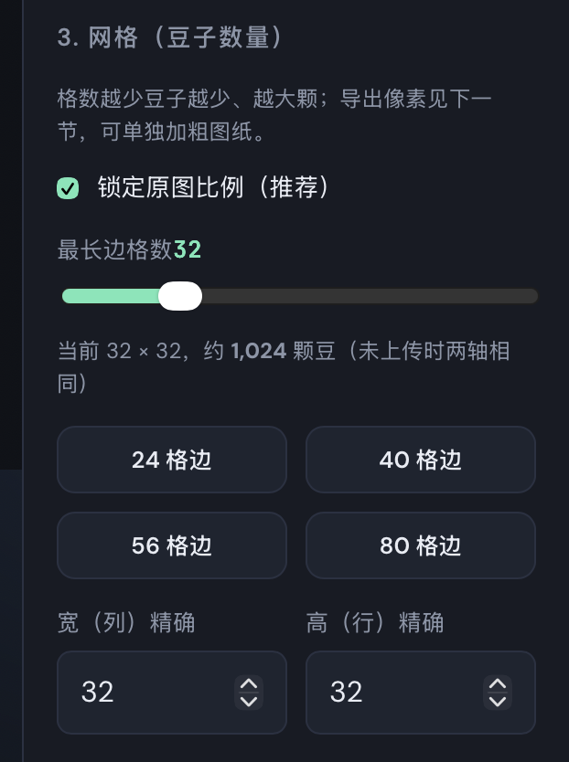

### 4. 导出格子大小（每格像素）

- 滑块范围：**10～56 px/格**（界面上的「下限偏好」）。
- **自动加清晰度**：格数很多时，程序会自动抬高每格像素，使 **PNG 长边尽量 ≥ 约 2400px**（且不超过每格上限），避免导出图太小看不清线号。
- **预览**也会单独按「约 640px 长边」一类规则加粗格子，和最终 PNG 的算法同源但目标像素不同。
- 修改滑块后，请再点 **「生成拼豆图纸」** 刷新预览。

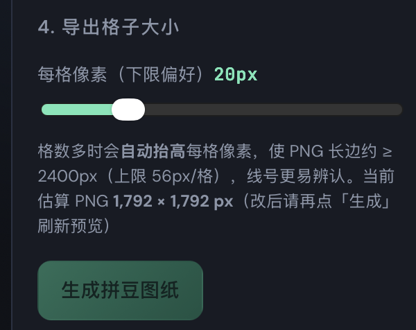

### 5. 生成与导出

1. 点 **「生成拼豆图纸」**：根据当前网格与色盘计算匹配结果，更新右侧预览与材料表。
2. **「下载 PNG」**：按当前匹配结果 + 自动清晰度规则导出位图。
3. **「下载 PDF」**：第 1 页为带网格与色号的图纸；后续页为 **材料清单**。PDF 内嵌文字为英文字体，清单里用 **色号 + HEX** 避免中文乱码；网页表格里仍是 JSON 中的英文色名。

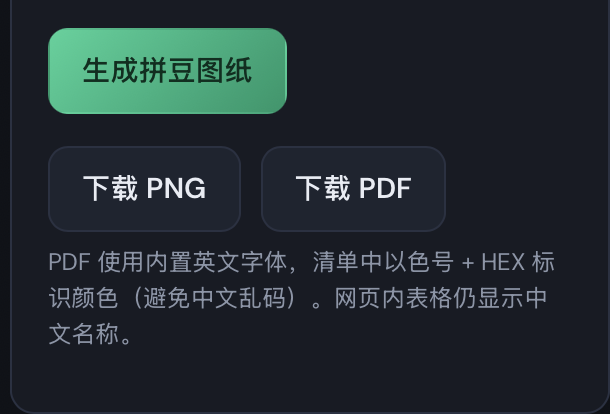

### 6. 图纸上你能看到的小细节

- **每个格子内**会标注 **色号**（如 `P01`、`S12`），并带描边以提高对比度。
- **每 5 格**有一条更醒目的 **红色主网格线**，其余为细灰线，方便「五粒一数」。
- 材料表按色号统计 **颗数**，并按用量排序。

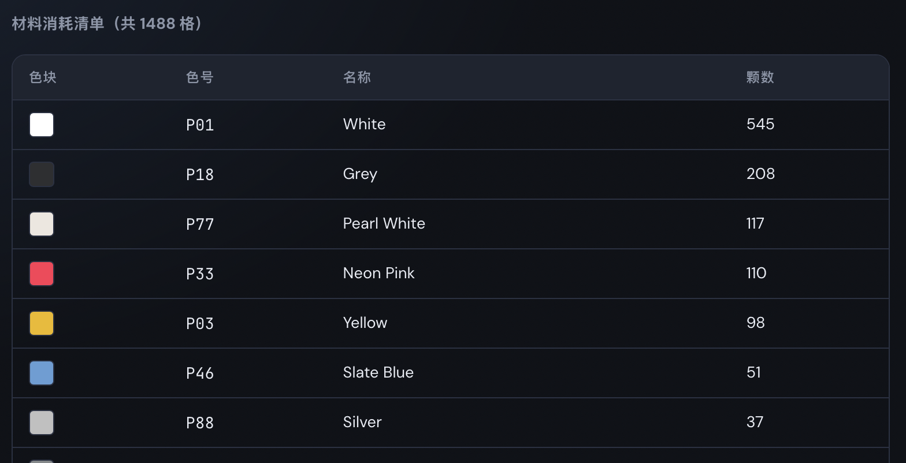
---

### 7. 效果预览示例
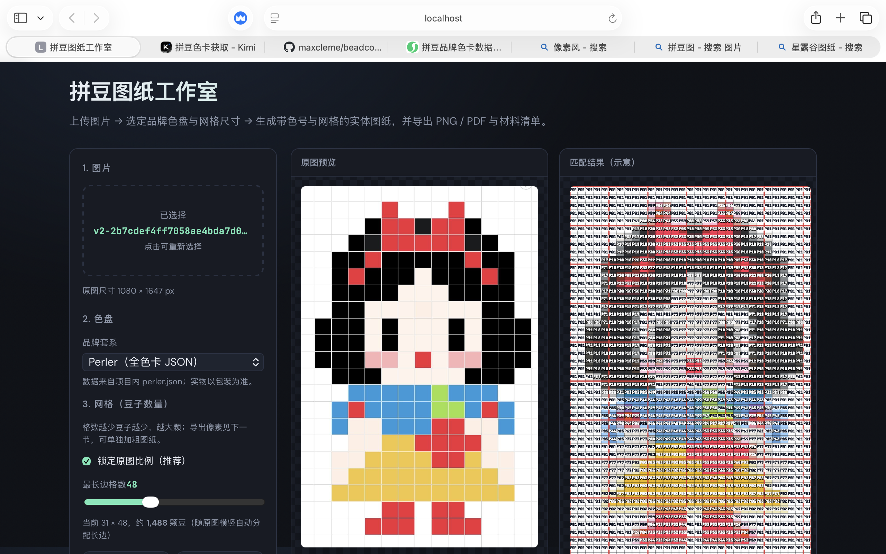
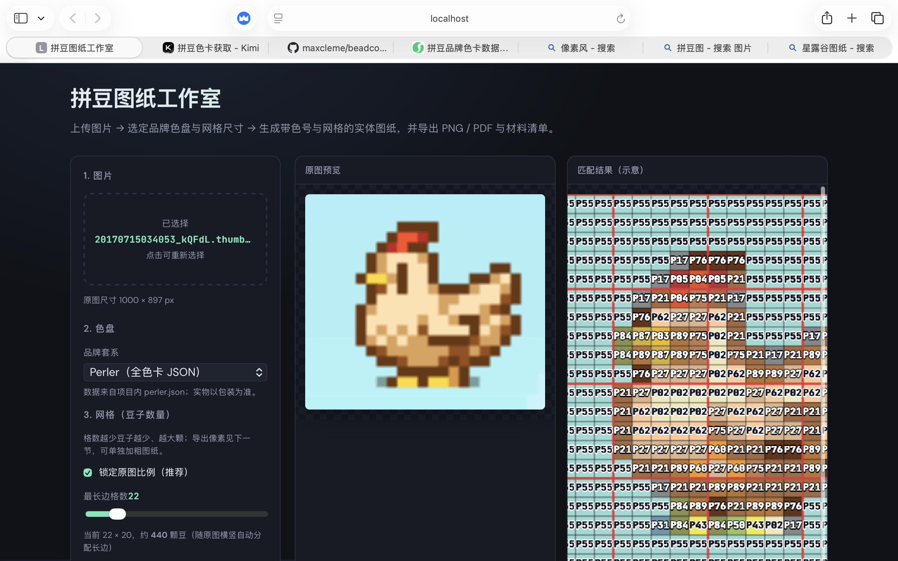

## 温馨提示
色卡参考网址已在以上标出，需要说明的是该网站提供的三个品牌的色卡包含基础色，不具有夸张数量的颜色类别。

本产品已在有限基础颜色下做出最佳颜色适配，如果图片颜色过多导致匹配后拼豆颜色数量不够用是色卡数量较少的问题。

例如丢一张色环进去是这种效果：
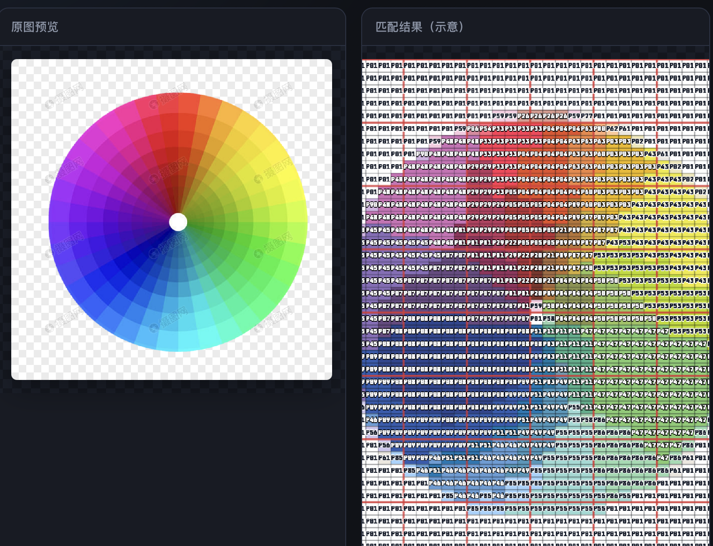

## 色卡数据（如何替换）

色卡为 JSON 数组，每条建议包含：`code`、`name`、`hex`（或 `rgb`）。文件路径：

- `src/data/palettes/perler.json`
- `src/data/palettes/artkal-s-5mm.json`
- `src/data/palettes/hama-midi.json`

替换后保存，重新执行 `npm run dev`（或重新 build）即可生效。

---

## 颜色匹配（实现上的说明）

- 每个格子的颜色：在 **线性光** 下与背景混合后再转 HEX，再进入匹配。
- 与色卡的比较在 **CIE L\*a\*b\*** 上进行 **CIEDE2000（ΔE₀₀）** 最近邻；比简单 RGB 距离或 ΔE76 更接近常见「肉眼色差」尺度。
- 实物豆子、屏幕、烫压后的颜色仍会偏差，**以实物为准**。

---

## 技术栈简述

- **Vite 5** + **React 18** + **TypeScript**
- 画布：`Canvas` 采样与导出
- PDF：**jsPDF**

---
